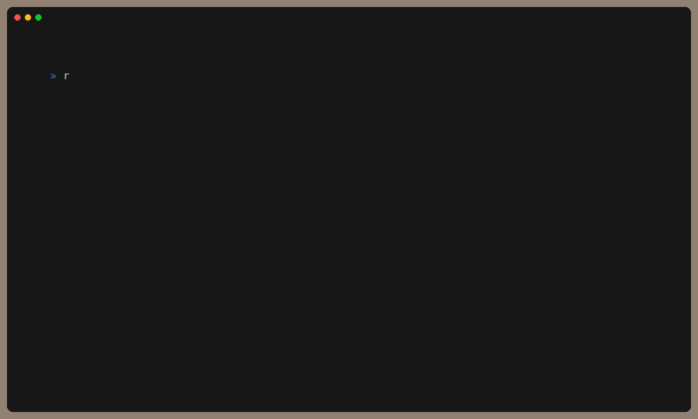

# roller

## Install

```sh
go install github.com/franklincm/roller@v0.0.1
```

## Usage
```
`roller` provides a convenient interface for fuzzy finding
GCP Role and Permissions. On first run it will fetch the complete
list of Roles and Permissons and persist it locally at:

~/.config/roller/roles.json

Usage:
  roller [flags]

Flags:
  -h, --help          help for roller
  -p, --permissions   find permissions for a given role
```

### Find Roles containing a Permission:

```sh
roller
```

### Find Permissions included in a Role:

```sh
roller -p
```

## Demo

